# TikZ Snippets Library

> **何时加载**：步骤 ③ 生成代码时，复杂档（含嵌入 viz / 信息 panel / 公式嵌入）**优先用 snippet 拼装**。
> **核心理念**：snippets 是手工精雕的乐高积木——sub-agent 拼装 N×M 组合，保证基线质量同时不千图一面。
> **PNG 预览在 `previews/` 目录**——sub-agent 选 snippet 前**先看 PNG 决定视觉效果**，再读 .tex 改参数。

## 为什么有这个目录

Batch 13-17 演化教训：纯文本 Philosophy + 18 项 checklist 让 sub-agent 知道"要嵌入 viz / panel / 公式"，但**写出来的视觉重量、留白、配色协调仍然失败**——因为这些是 visual perception 而非 textual 任务。

**Snippet Library 解决方案**：给 sub-agent 一套**手工精雕的 TikZ 片段**（21 个，每个 30-100 行），sub-agent **看 PNG 选 + 复制粘贴 + 替换参数** 即可达到 examples 06-10 水平。

## 📚 Snippet Gallery（21 个，按用途分组）

### 1. 嵌入数据可视化（embedded data viz）

| 文件 | 用途 | 预览 |
|---|---|---|
| `attention-heatmap.tex` | N×N attention 热力图 + colorbar | 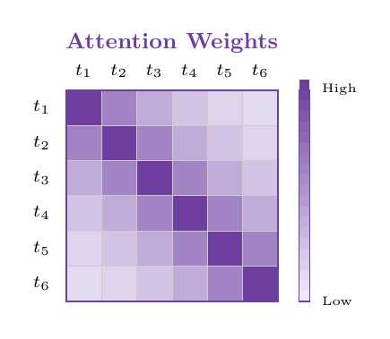 |
| `confusion-matrix.tex` | N×N 分类混淆矩阵 + 数值 | 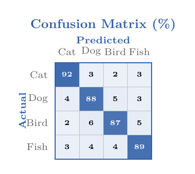 |
| `mini-spectrogram.tex` | Mel 频谱图（time × freq）| 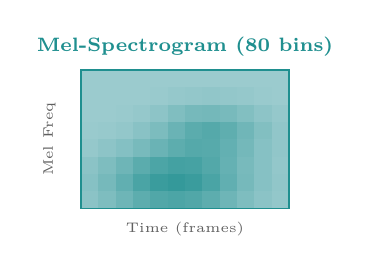 |
| `image-strip.tex` | 彩色图像色块序列（diffusion 类）| 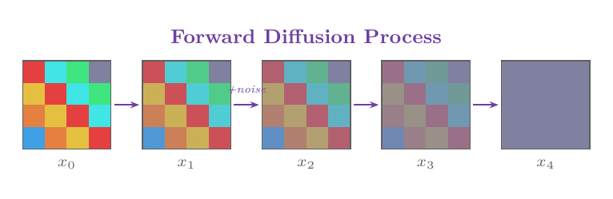 |
| `scatter-plot.tex` | 散点图 + R² + y=x 参考线 | 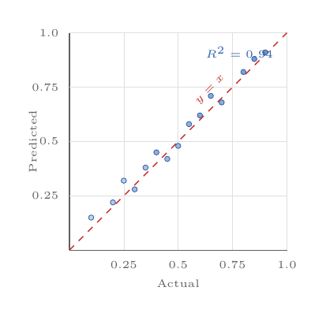 |
| `embedded-graph.tex` | 真实 graph 节点结构（star / cycle）| 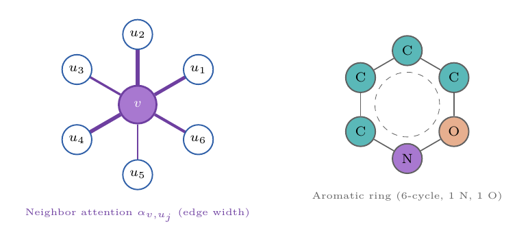 |

### 2. 信息 panel / 图表（charts & tables）

| 文件 | 用途 | 预览 |
|---|---|---|
| `bar-chart.tex` | Benchmark 柱状图 + grid + 数字 | 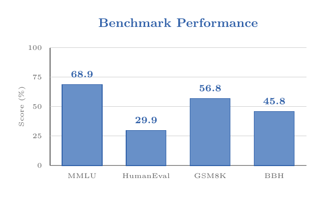 |
| `line-chart.tex` | 折线图（loss / accuracy curve）| 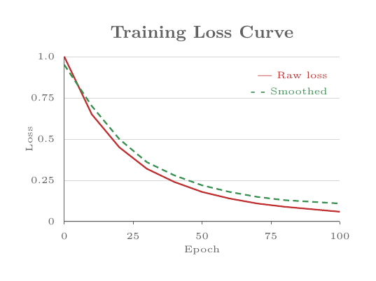 |
| `radar-chart.tex` | 雷达图（多维度模型对比） | 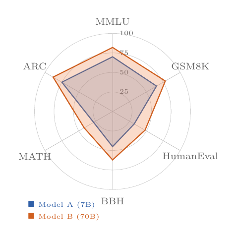 |
| `hyperparams-table.tex` | 参数表 + 交替行 fill | 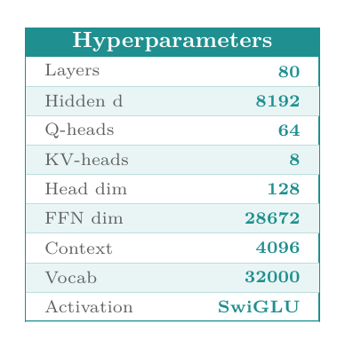 |
| `metrics-card.tex` | 单 metric 卡片 (FID=3.17) | 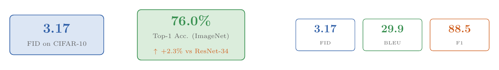 |

### 3. 数学 / 几何（math viz）

| 文件 | 用途 | 预览 |
|---|---|---|
| `gaussian-curve.tex` | 高斯分布 + σ region + 临界值 | 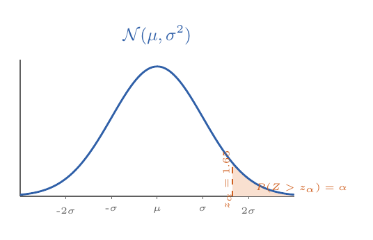 |
| `vector-arrows.tex` | 梯度/特征向量可视化 | 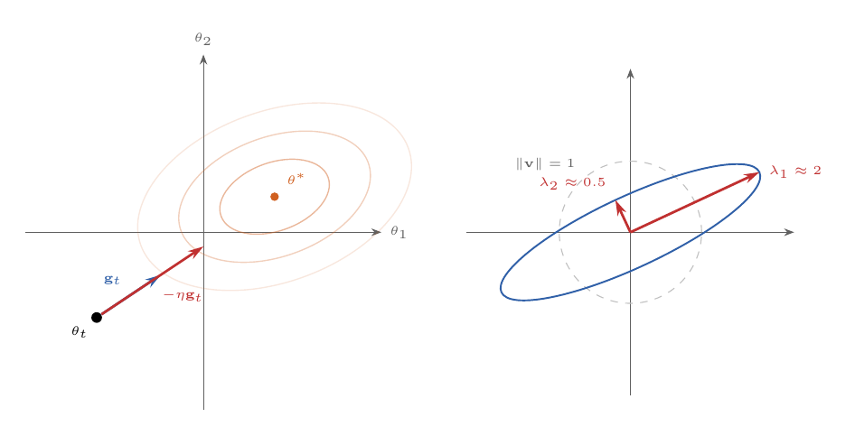 |
| `formula-box.tex` | 公式 box 3 variant | 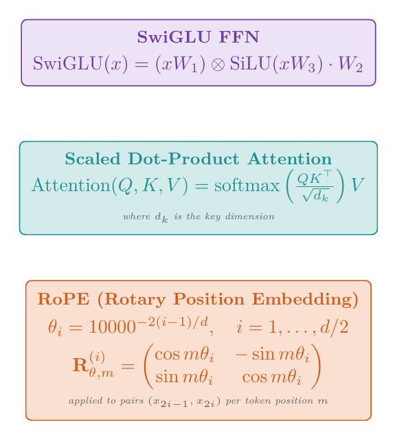 |

### 4. 结构 / 流程（structure & flow）

| 文件 | 用途 | 预览 |
|---|---|---|
| `stage-container.tex` | Stage 容器（标题 zone + anchor） | 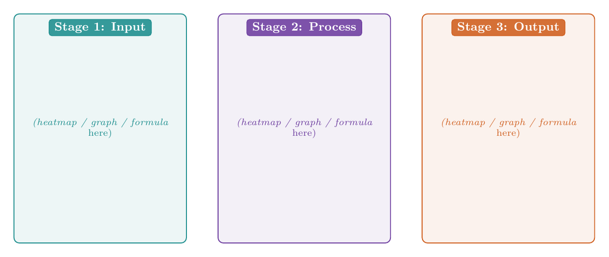 |
| `pipeline-stages.tex` | N-stage 水平管线 + 自动 arrow | 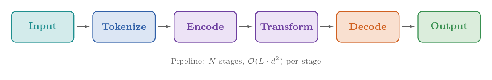 |
| `layer-stack.tex` | "N=6 layers" 灰色透明栈 | 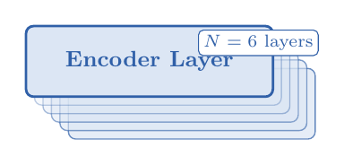 |
| `feedback-loop.tex` | Autoregressive / 反馈环 | 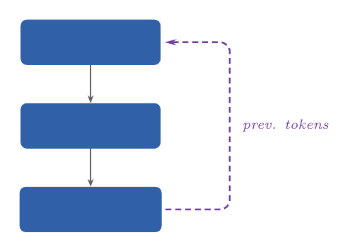 |

### 5. 整图骨架元素（whole-figure scaffolding）

| 文件 | 用途 | 预览 |
|---|---|---|
| `multi-zone-palette.tex` | 6 色 zone tone 标准模板 | 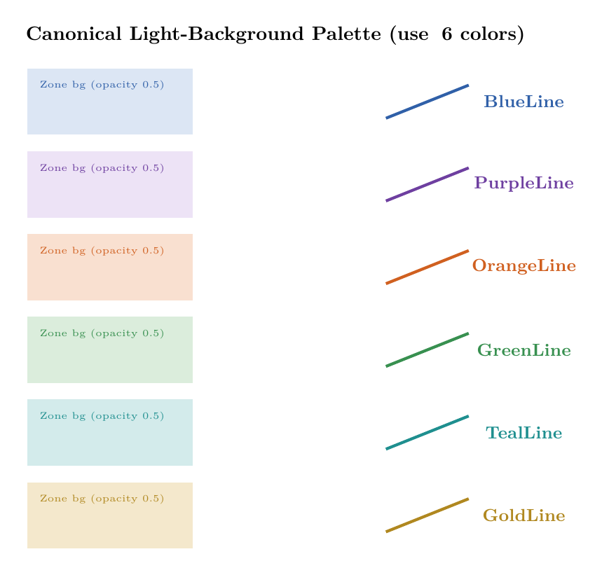 |
| `color-legend.tex` | 底部 N 色 legend strip |  |
| `summary-bar.tex` | 底部 pipeline summary bar |  |

### 6. 🏆 完整 Figure 范例（GOLD STANDARD — sub-agent 复制后改 content）

**Batch 19 用户反馈**：snippets 单个完美但**组合时仍有重叠/排版问题**。原因：sub-agent 复制 snippet 后自己定位坐标。这 6 个范例提供**完整 figure.tex 骨架**（含精确 zone 位置、所有 element 都 bounded 在 zone 内），sub-agent **复制整文件后只改 content** = 零位置 bug。

**Batch 20 用户复审**：原 2 个范例（B/C）已生效（1 round 收敛 + 0 位置 bug）。**新增 4 个 GOLD STANDARD 范例**（D/E/F/G），都从用户历史质量最高的产物直接复制改造而来。

| 文件 | 骨架 | 适用场景 | 预览 |
|---|---|---|---|
| `example-skeleton-B-horizontal.tex` | **B: 5 stage 横向** | Pipeline 类 / 训练流程 | 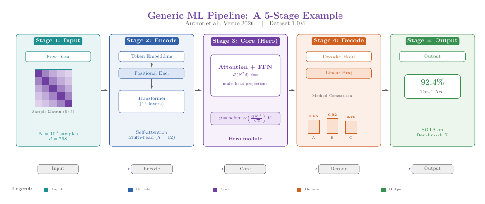 |
| `example-skeleton-C-centralhero.tex` | **C: 中央 hero + 4 panels** | Model card / Architecture paper | 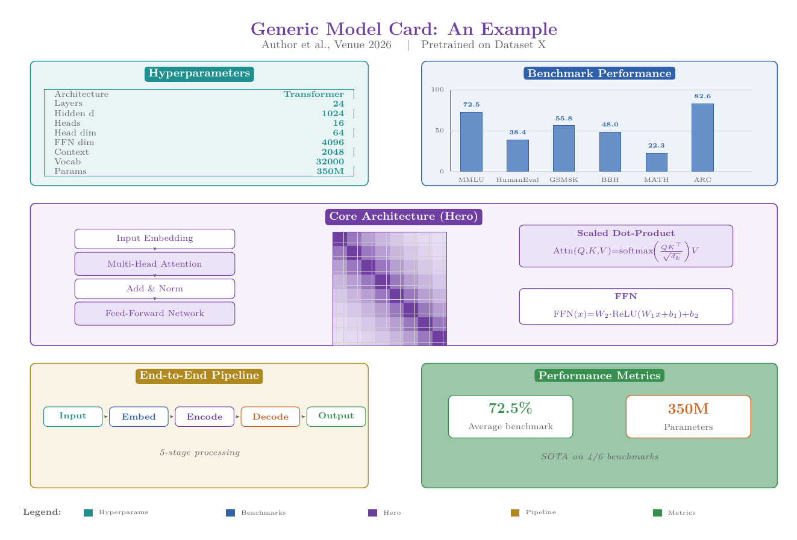 |
| `example-skeleton-D-vertical-sidepanel.tex` ⭐ | **D: 3 段竖向 + 右侧 side panel** | 联邦学习 / 多方协议 / 安全分析含 radar | 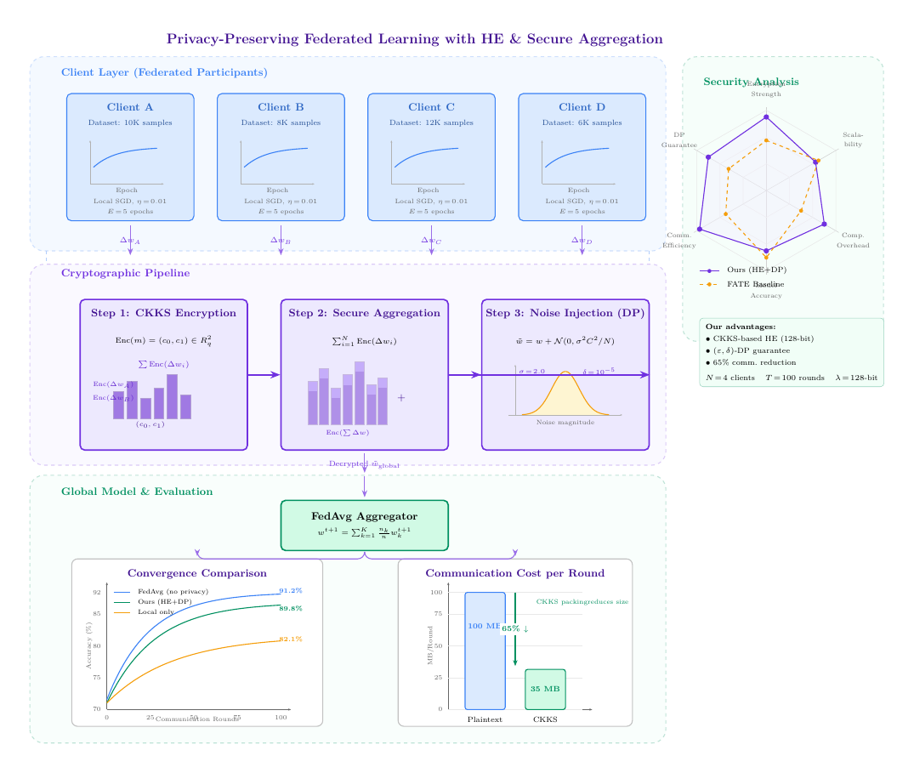 |
| `example-skeleton-E-multimodal-fusion.tex` ⭐ | **E: 5 stage + 多平行 input + 多 viz** | 多模态融合 (vision+text+audio) / 可解释 AI | 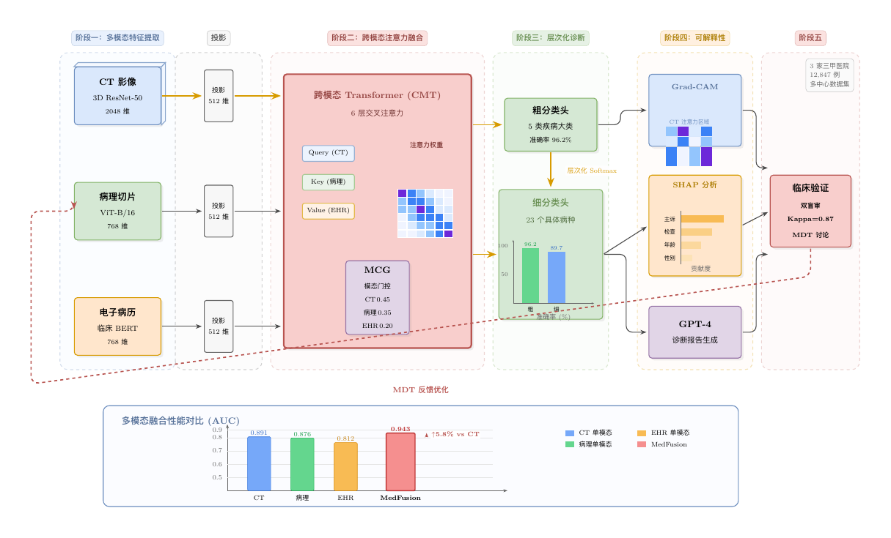 |
| `example-skeleton-F-multiphase-multisub.tex` ⭐ | **F: 4 phase + 每 phase 多 vertical sub-elements** | 多方协议 (MPC / threshold sig) / 多阶段含内部多元素 | 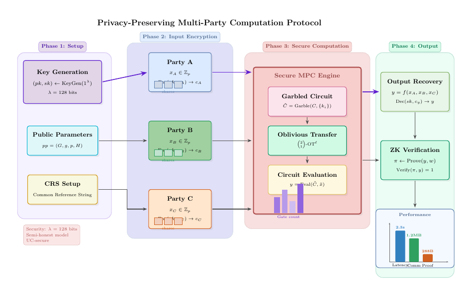 |
| `example-skeleton-G-federated-vertical.tex` ⭐ | **G: 3 层竖向 + 中央 hero + N 平行 instance** | 联邦学习 / 边缘云 / 1 central + N parallel | 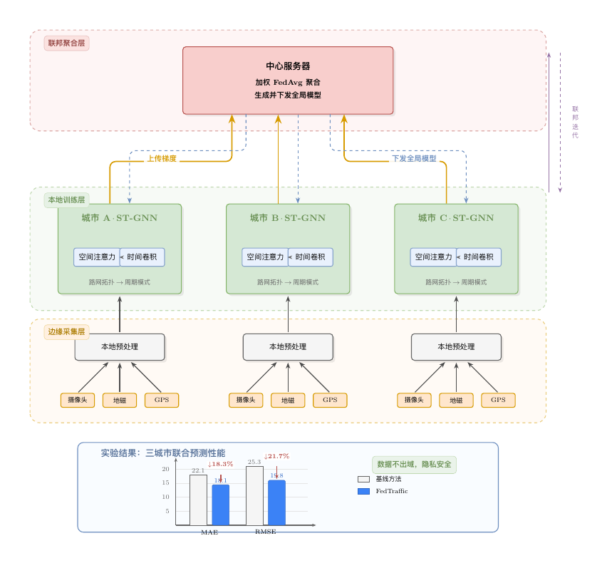 |

**关键设计原则**（这 2 个范例都遵循）：

- **显式 (x0, y0, x1, y1) rectangle 而非 fit 库**——避免"zone 外溢"陷阱
- **每个 zone 用 `\drawzone` 或 `\drawstage` 辅助函数**——保证 bg + border + title 一致
- **同 row 模块同 y baseline + 同 height**——`COMPOSITION-RULES.md` 铁律
- **bar chart 用 hard-code `\foreach \i/\name/\val`**——避免 idx 累加 bug
- **所有 content 显式 inside zone rect**——不超出 zone

**Sub-agent 使用流程**：
1. 选骨架 B（pipeline 类）或 C（hero + panels 类）
2. 复制对应 example.tex 为 `figure.tex`
3. 改 title + zone titles + box labels + 数字 + 公式
4. 不要改 zone 坐标、不要改 helper macros、不要改 layout grid
5. 编译 → 看效果 → 微调 content（不动结构）

## 使用规则

1. **先看 PNG 选 snippet**——`previews/` 里有所有 demo PNG，视觉决定选哪个
2. **复制 .tex 中 `%% COPY-START / END` 段**到你的 figure.tex，替换 placeholder 参数
3. **不要修改 snippet 核心结构** — 只改 placeholder（如 `{{N}}` / `{{cell_size}}` / `{{label_prefix}}`）
4. **多个 snippet 拼装时** 用 `multi-zone-palette.tex` 的颜色 token 保持统一
5. **必读 `COMPOSITION-RULES.md`** —— snippets 之间的留白 / 对齐 / Z-order

## 不要做的事

- ❌ 看 examples 06-10 PNG 然后照抄主题——这些 snippet 已经抽象了"设计语法"
- ❌ 自创"简化版" snippet——简化 = 信息稀疏 = 平庸
- ❌ 用 snippets 但**只用一个**——复杂档应该拼 ≥ 3 个 snippet
- ❌ 跳过 `previews/` PNG 直接读 .tex 想象效果——浪费 token 且容易选错

## 编译验证

每个 snippet 文件本身是 **standalone 可编译的 .tex**——可以直接：
```bash
xelatex attention-heatmap.tex
```
看 demo 效果。然后把核心代码段（`%% COPY-START` 到 `%% COPY-END`）复制到你的 `figure.tex`。

## 已知避坑（PGF gotchas）

写新 snippet 时必避免：

| Bug 模式 | 修复 |
|---|---|
| `\pgfmathsetmacro\idx{\idx+1}` 在 `\foreach` 内累加 | 改用 `\foreach [count=\idx] \k/\v in ...` |
| `plot coordinates {\foreach ...}` 不展开 | 先 `\foreach` 计算 + `\coordinate (cN)` 命名，再 `(c1) -- (c2) -- ...` chain |
| `()` 内表达式 `(\xA + 0.05, ...)` 不 evaluate | `\pgfmathsetmacro\px{\xA + 0.05}` 预计算 OR `({...})` wrap |
| macro 名含数字-字母（`\v1x`）→ pgfmath 把 `1x` 当 `1*x` | 改名 `\vAx` / `\vOneX` |
| `\foreach` data 含 `,` (如 `(\mathbf{A}, \mathbf{X})`) | hard-code 替代 OR 改用 `:` 分隔 |
| `$\blacksquare$` 等 amssymb 字符 | preamble 加 `\usepackage{amssymb}` |
| `ellipse (\r and \r*0.6)` 紧接 → `2.0and 2.0*0.6` parse 失败 | `ellipse (\r cm and \ry cm)` + 预计算 `\pgfmathsetmacro\ry{\r*0.6}` |
